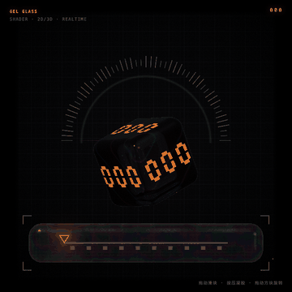

# Gel Glass · Internet Speed UI

一个受 WebGL / GLSL 视觉实验启发的网速仪表 UI 原型。页面用实时着色器绘制半圆仪表、折射玻璃数字方块和可交互的凝胶进度条，不依赖图片素材或第三方前端框架。



## 功能

- 半圆刻度仪表：进度从 0 到 100 时，刻度、弧线和指示器同步点亮。
- 折射玻璃方块：使用 SDF 光线步进绘制圆角立方体，支持玻璃反射、折射、色散和边缘高光。
- 清晰的七段数字：数字位于玻璃表面，内部流体光丝不会覆盖读数。
- 凝胶进度条：默认状态保持水平平直；拖动时产生布料褶皱、按压凹陷和橙色局部发光。
- 方块旋转：鼠标或触控拖动方块即可旋转，水平拖动控制左右角度，垂直拖动控制俯仰角。
- 进度驱动发光：低进度使用低亮度彩色流体光丝和暖色光核，进度升高后逐渐增强到高亮状态，反向拖动会平滑恢复。
- 移动端适配：画布使用 `100vw × 100vh`，并针对窄屏调整 HUD 布局。

## 技术实现

- 原生 HTML / CSS / JavaScript
- WebGL 1.0 + GLSL fragment shader
- SDF（Signed Distance Field）圆角盒与凝胶条建模
- Ray marching 光线步进与法线估计
- 屏幕空间网格、半圆刻度和七段数字生成
- GLSL `refract` / `reflect` 实现玻璃折射与反射
- RGB 分通道采样实现轻微色散效果
- 弹簧积分模拟滑块、凹痕和按压回弹
- `Pointer Events` 统一鼠标、触控和触控笔输入

## 本地运行

项目是静态页面，不需要构建步骤。使用任意静态服务器启动即可：

```bash
python3 -m http.server 5174
```

然后打开：

```text
http://127.0.0.1:5174/gel-glass.html
```

也可以直接双击 `gel-glass.html`，但部分浏览器对本地文件的 WebGL 调试信息会更少，推荐使用静态服务器。

## 操作方式

| 操作 | 效果 |
| --- | --- |
| 拖动底部凝胶条 | 调整进度并驱动仪表、数字与内部发光 |
| 按住或拖动凝胶条 | 产生局部凹陷和凝胶形变 |
| 拖动中央方块 | 旋转玻璃方块 |
| 短按中央方块 | 触发一次果冻式回弹 |
| 键盘 ← / → | 以 5% 步进调整进度 |

## 项目结构

```text
.
├── gel-glass.html          # 完整的 WebGL 页面与交互逻辑
├── assets/
│   └── gel-glass-demo.gif   # README 演示动效
└── README.md
```

## 开源说明

本项目定位为可学习、可修改、可复用的前端视觉实验。核心实现集中在单个 HTML 文件中，方便复制到个人作品集、交互原型或 WebGL 学习项目中。

当前仓库未绑定外部运行时依赖，也没有上传用户数据或网络请求。公开发布前，建议根据你的仓库账号补充 `LICENSE` 文件；如果希望采用宽松的开源授权，MIT License 是适合这个原型的选择。

## 致谢与参考

视觉方向参考了 Jae 的 “Jelly glass” WebGL 实验：

<https://x.com/Jaenam97/status/2089369244198650193>

本项目为独立实现，未复制原项目源码或素材。
